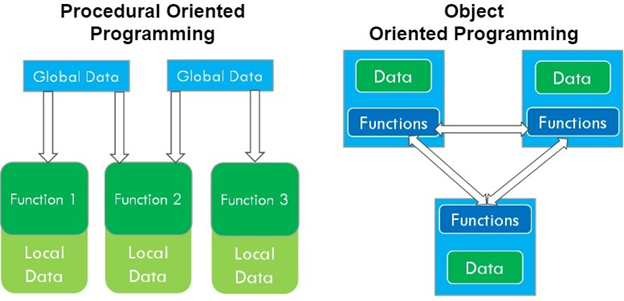

# [객체지향] 객체지향 프로그래밍에 대한 이해

객제지향 프로그래밍에 대해 연구해보자.

* toc
{:toc}

{:.lead width="800" height="100"}
POP vs OOP
{:.figure}

## 절차지향 프로그래밍
- 순서도처럼 절차적으로 코드를 구성하는 것을 말한다.
- 모듈이나 함수를 순서에 맞게 단계적으로 실행하게 된다.
- 장점
  - 컴퓨터 처리구조와 비슷하여 실행 속도가 빠르다.
- 단점
  - 실행 순서가 정해져 있어 코드 순서가 바뀌면 동일한 결과를 보장하기 어렵다.
  - 유지보수 및 디버깅이 어렵다.


## 객체지향 프로그래밍
- 기능이 아닌 객체가 중심이 되어 객체를 도출하고 각각의 역할을 정의하는 것에 초점을 맞춘다.
- 장점
  - 코드 재사용이 가능하다.
  - 분석과 설계의 전환이 쉽다.
- 단점
  - 처리 속도가 상대적으로 느리다.
  - 설계에 많은 시간이 소요된다.

## 객체(Object), 클래스(Class), 인스턴스(Instance)
`객체(Object)`
- 물리적으로 존재하거나 추상적으로 생각할 수 있는 것 중 자신만의 속성을 갖고 있거나 다른 것과 식별 가능한 것
- 세상에 존재하는 유일무이한 사물

`클래스(Class)`
- 객체를 생성하기 위한 설계도
- 같은 특성을 지닌 여러 객체를 총칭하는 집합
- 필드, 생성자, 메서드로 구성
  ```
  필드(Field): 객체 데이터 저장
  생성자(Constructor): 객체가 실제로 생성될 때 초기화
  메서드(Method): 객체의 동작 (실행)
  ```

  ```java
  public class Person {

      // 필드
      String name;
      int age;

      // 생성자
      Person(String name, int age) {
        this.name = name;
        this.age = age;
      }

      // 메서드
      void walk() {
          System.out.println("걷다.");
      }

      void run() {
          System.out.println("걷다.");
      }
  }
  ```

`인스턴스(Instance)`
- 현실의 객체를 소프트웨어 내에서 구현한 실체

  ```java
  public class MakeInstance {
      public static void main(String[] args) {
          
          // 인스턴스
          Person person = new Person("naekang", 20);

          person.walk();
      }
  }
  ```


## 객체지향의 4대 특성

### 1. 추상화(Abstraction)
- 구체적인 것을 분해해서 관심 영역(애플리케이션 경계)에 있는 특성만 가지고 재조합 하는 것
- `모델링`

### 2. 상속(Inheritance) 
- `재사용` + `확장(extends)`
- **하위 클래스는 상위 클래스이다.** = `리스코프 치환 원칙(LSP)`
- **하위 클래스 is a kind of 상위 클래스**
  - `is a`관계의 경우 논리적인 오류가 발생할 수 있다.
    - 하위 클래스 = 분류
    - 상위 클래스 = 분류
    - but, 하나의 상위 클래스 = 하나의 객체
    - 가장 정확한 표현은 `is a kind of`
- 인터페이스는 **무엇을 할 수 있는(be able to)**의 형태로 만드는 것이 좋다.
  - ex) Serializable, Clonable, Comparable, Runnable
- 실무에서는 의외로 상속을 많이 사용하지 않는다.
  - 상속 시 Override를 한 것과 안한것의 혼란
  - 상속 Override를 잘못하면 로직 충돌 = `Fagile base class 문제`
  - 기능을 너무 확장하거나 변경하면 재활용성이 낮아짐
- 상속의 대안
  - 상속을 위한 설계를 한 클래스만 상속하기
  - 부모 클래스 상속 대신 인터페이스 활용
  - 부모와 상호 치환이 가능하도록 = 부모 클래스와 동일한 기능 제공 
- Java에서 다중상속을 지원하지 않는 이유 = **다이아몬드 문제**
  - 코드 참고
  ```java
  class GrandFather {
      void myMethod() {
          System.out.println("할아버지");
      }
  }
  // FatherA class
  class FatherA extends GrandFather {
      @Override
      void myMethod() {
          System.out.println("아버지A");
      }
  }
  // FatherB class
  class FatherB extends GrandFather {
      @Override
      void myMethod() {
          System.out.println("아버지B");
      }
  }
  // Son class
  class Son extends FatherA, FatherB {
      @Override
      void myMethod() {
          super.myMethod();
      }
  }
  ```
  - interface는 다중 상속 가능
  - Son 클래스는 FatherA와 FatherB 중 어떤 메서드를 실행해야 할 지 모른다.
  - C++의 경우는 개발자에게 이런 문제를 일임하였으나 자바는 막아두었다.

### 3. 형성(Polymorphism)
`오버라이딩(Overriding)`
- 상위 클래스의 메서드와 같은 시그니처(이름, 반환형, 인자)로 메서드를 재정의하는 것
```java
// Member class
public class Member {
    void test() {
        System.out.println("매개변수: 0");
    }

    void test(double d) {
        System.out.println("매개변수: " + d);
    }

    void test(int a, int b) {
        System.out.println("매개변수: " + a + ", 매개변수: " + b);
    }
}
// test class
public class Test {
    public static void main(String[] args) {
        // Member 인스턴스 생성
        Member member = new Member();

        // test() 호출
        member.test();

        // test(double d) 호출
        member.test(123.456);

        // test(int a, int b) 호출
        member.test(10, 20);

        // test(double d) 호출
        member.test(30);
    }
}
```
  
`오버로딩(Overloading)`
- 메서드 이름만 같고 시그니처가 다른 것
- `System.out.println()` 참고

### 4. 캡슐화(Encapsulation)
- 정보의 은닉화
- 장점
  - 데이터 보호
  - 유지 보수성 향상
  - 사용자 편의성
- 접근제어자
  - `public`
    - package, class가 달라도 모든 접근이 가능
  - `protected`
    - 같은 package만 접근 허용, 다른 package에서 접근하려면 해당 class를 상속받아야 함
  - `default`
    - 동일 package에서만 접근 허용
    - 자동 선언 -> 명시해서는 안됨
  - `private`
    - 같은 class 내에서만 접근 허용, 같은 파일 내에 다른 class도 접근 불가
    - 동일 package, 다른 package 모두 접근 불가능
- 접근 제어자의 사용 범위
  - Class: `public`, `default`
  - Constructor: `public`, `protected`, `default`, `private`
  - 멤버 변수: `public`, `protected`, `default`, `private`
  - 멤버 메서드: `public`, `protected`, `default`, `private`
  - 지역 변수: 접근 제어자 사용 불가능